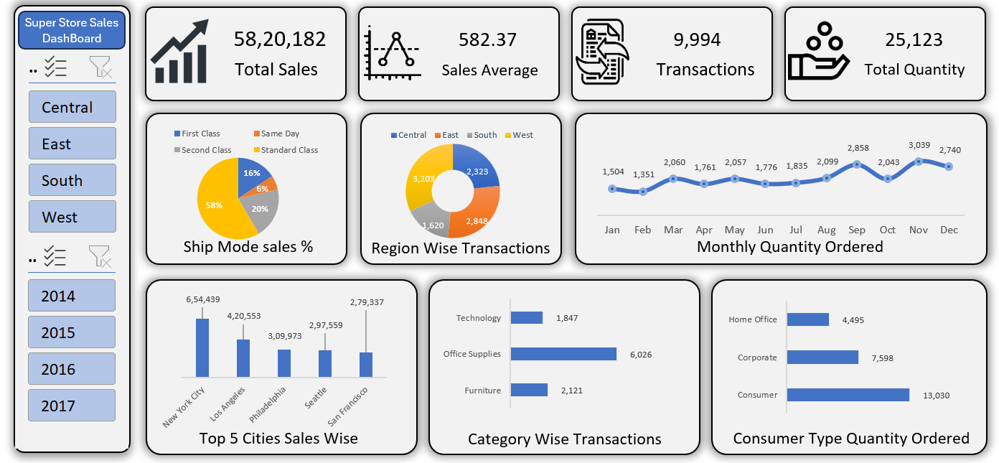

# 📊 Super Store Sales Dashboard (Excel)

## 📌 Project Overview

This project is an interactive Sales Dashboard built in Microsoft Excel using the Super Store dataset.

The dashboard provides valuable business insights by analyzing sales performance, customer orders, transactions, categories, shipping modes, and regional trends through dynamic visualizations and slicers.

---

## 🚀 Dashboard Preview

---

## 📈 Key Performance Indicators (KPIs)

- Total Sales: ₹58,20,182
- Sales Average: ₹582.37
- Total Transactions: 9,994
- Total Quantity Ordered: 25,123

---

## 📊 Dashboard Features

### Regional Analysis
- Central Region
- East Region
- South Region
- West Region

### Year-wise Filtering
- 2014
- 2015
- 2016
- 2017

### Business Insights
- Ship Mode Sales Distribution
- Region-wise Transactions
- Monthly Quantity Ordered Trend
- Top 5 Cities by Sales
- Category-wise Transactions
- Consumer Type Quantity Ordered

---

## 🛠️ Tools & Techniques Used

- Microsoft Excel
- Pivot Tables
- Pivot Charts
- Slicers
- Doughnut Charts
- Line Charts
- Bar Charts
- Data Cleaning
- Dashboard Design

---

## 💡 Key Insights

- Standard Class contributes the highest percentage of sales.
- West region records the highest transaction volume.
- Consumer segment places the highest quantity of orders.
- Technology and Office Supplies categories generate significant business activity.
- Sales are concentrated among major cities such as New York City and Los Angeles.

---

## 🎥 Dashboard Demo Video

Watch the complete dashboard walkthrough here:

👉 https://www.linkedin.com/posts/prakash-yadav786_excel-microsoftexcel-dashboard-ugcPost-7468147275995955200-IzHw/

---

## 📂 Files Included

- Superstore Data.xlsx
- Dashboard Final.xlsx
- Dashboard Screenshot
- README.md

---

## 👨‍💻 Author

### Prakash Yadav

Aspiring Data Analyst

### Skills
Excel | SQL | Power BI | Data Analysis | Dashboard Development

🔗 LinkedIn:
https://www.linkedin.com/in/prakash-yadav786/

🔗 GitHub:
https://github.com/Prakash-Yadav786

---

⭐ If you found this project useful, feel free to star the repository.
